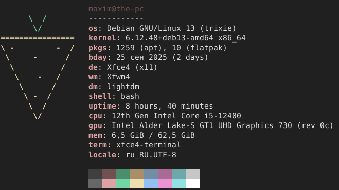

# yofetch
yofetch is a fast, minimal system fetch tool written in Go

information about the API configuration can be found [here](LuaConfigInfo.md)

## features
- fast & portable
- configurable via Lua API
- minimal dependencies
- cross-platform

> dependencies: [pflag](https://github.com/spf13/pflag), [gopher-lua](https://github.com/yuin/gopher-lua)

# platforms

- linux x64: prebuilt binaries available
- windows, macOS, freebsd: manual compilation required

## note
- on windows 10/11, run yofetch in [windows terminal](https://github.com/microsoft/terminal), since cmd does not support ansi color codes
- on linux/macOS, run yofetch in modern terminal emulators with true color support, since older terminals may not fully support ansi color codes

# contributing
pull requests are welcome - please keep speed and minimalism in mind

report issues [here](https://github.com/m1lkydev/yofetch/issues)
